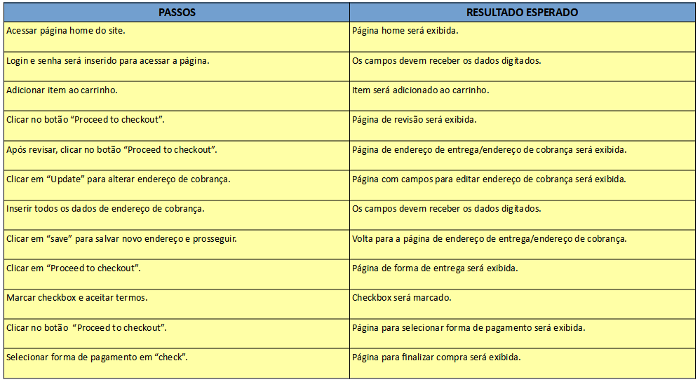
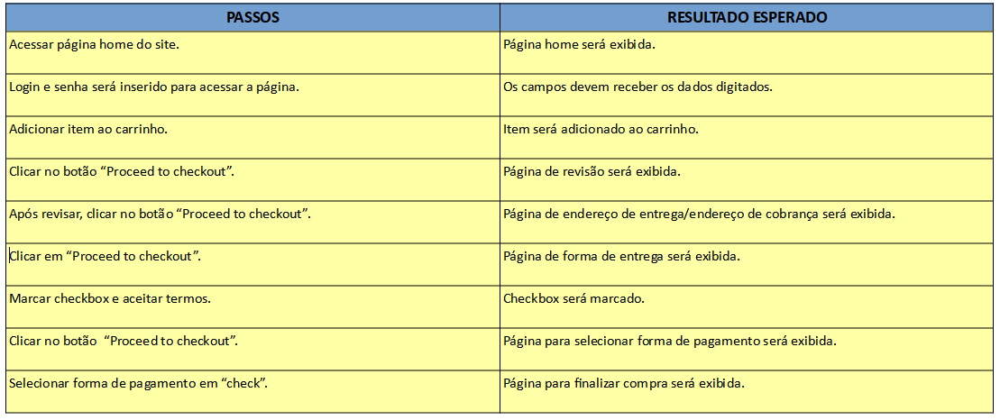

# Desafio QA Justa

## 🚀 Começando

Projeto contendo 3 casos de teste para a funcionalidade de Compra.

### 📋 Pré-requisitos

Python versão 3.10.5 
Pip instalado
Google Chrome na versão 103.0.5060.134, caso não tenha será necessário baixar um driver da versão correspondente e substituir pelo que já está instalado. 
Selenium webdriver.

### 🔧 Instalação

Link para Download do python 3.10.5 - https://www.python.org/downloads/release/python-3105/ 
Link para Download do pip - https://phoenixnap.com/kb/install-pip-windows
Driver Google Chrome - https://chromedriver.chromium.org/downloads 
Instalação selenium webdriver - Comando através do terminal pip install selenium

### 🛠️ Planejamento de testes

Plano 1 - Realizar a compra de produto e alterar o endereço de entrega.

Plano 2 - Realizar a compra do produto e alterar o endereço de cobrança.

Plano 3 - Realizar a compra e efetuar o pagamento com cheque.

